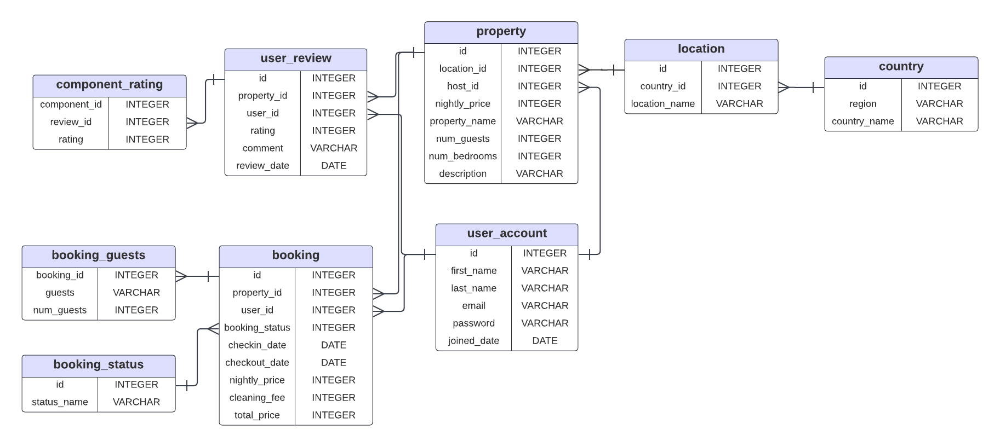

### Проект "Аренда жилья по всему миру"

---
Имеется база данных для аренды жилья по всему миру. В ней имеется информация о недвижимости, зарегистрированных пользователях, деталях бронирования.
С помощью этой базы данных пользователи по всему миру смогут в считанные секунды узнавать информацию о домах, которые их заинтересовали, а также сразу же бронировать их. С помощью `user_review` пользователь сможет прочитать отзывы других людей, чтобы точно не ошибиться с выбором.

`property`

Вся информация о недвижимости (идентификатор, место, название недвижимости, цена за одну ночь, максимальное количество людей, которые смогут разместиться одновременно, количество спальных мест и подробное описание)

`user_account`

Аккаунт пользователя (идентификатор, имя, фамилия, почта, пароль, дата регистрации)

`booking`

Бронирование (идентификатор недвижимости и пользователя, статус бронирования, дата заселения, дата выселения, цена за одну ночь, плата за уборку, общая стоимость)

Изобразим концептуальную модель

Изобразим теперь логическую модель

---
БД имеет 3 НФ
